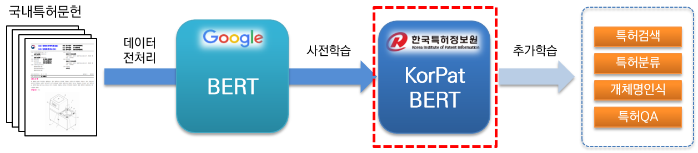

# 특허분야 한국어 AI언어모델 KorPatBERT
KorPatBERT(Korean patent BERT)는 [한국특허정보원](https://www.kipi.or.kr)이 연구개발한 AI 언어모델입니다. 
 특허분야 한국어 자연어처리 문제 해결 및 특허산업분야의 지능정보화 인프라 마련을 위해 기존 [Google BERT base](https://github.com/google-research/bert) 모델의 아키텍쳐를 기반으로 대용량 국내 특허문헌(약 406만건, 120GB, 266억 토큰)을 사전학습(pre-training)하였고, 무료로 제공하고 있습니다.
## 
- [1. KorPatBERT](#1.-KorPatBERT)
- [2. KorPatBERT 개요](#2.-KorPatBERT-개요)
  - [2.1. 사전학습 환경](#2.1.-사전학습-환경)
  - [2.2. 학습데이터](#2.2.-학습데이터)
  - [2.3. 사전 및 토크나이저](#2.3.-사전-및-토크나이저)
  - [2.4. 성능결과](#2.4.-성능결과)
- [3. KorPatBERT 사용 안내](#3.-KorPatBERT-사용-안내)
  - [3.1. 요구사항](#3.1.-요구사항)
  - [3.2. 토크나이저](#3.2.-토크나이저)
    - [3.2.1. Mecab 설치 및 사용자사전 추가](#3.2.1.-Mecab-설치-및-사용자사전-추가)
    - [3.2.2. MSP 토크나이저 사용](#3.2.2.-MSP-토크나이저-사용)
  - [3.3. 파인튜닝](#3.3.-파인튜닝)
- [4. KorPatBERT 정책 및 제공 문의](#4.-KorPatBERT-정책-및-제공-문의)
  - [4.1. 담당부서 및 모델 제공](#4.1.-담당부서-및-모델제공-문의)
  - [4.2. 라이센스](#4.2.-라인센스)
  - [4.3. 협약서](#4.3.-협약서) 
 
&nbsp;
## 1. KorPatBERT
특허분야 특화된 고성능 사전학습(pre-trained) 언어모델로 다양한 자연어처리 태스크에서 활용 할 수 있습니다.

&nbsp;

&nbsp;
## 2. KorPatBERT 개요
### 2.1. 사전학습 환경
#### 개발환경
- Anaconda >=4.6.8
- Python >= 3.6
- MSP Tokenizer(Mecab-ko Sentencepiece Patent Tokenizer)
- Tensorflow-gpu >= 1.15.0
- Sentencepiece >= 0.1.96
- Horovod >= 0.19.2
#### 학습환경
- 특허문헌 120GB 코퍼스의 4억 6천만 문장 학습
- NVIDIA V100 32GB GPU 16개 및 분산학습 라이브러리 Horovod를 이용하여 학습
- NVIDIA AMP(Automated Mixed Precision) 방식을 활용하여, 메모리 최적화
- 128 Sequence 2,300,000 Step 학습 + 512 Sequence 750,000 Step 학습

### 2.2. 학습데이터
- 특허문헌수 : 4,065,519건
- 문장 수 : 460,448,189건
- 토큰 수 : 약 266억건
- 코퍼스 크기 : 약 120GB

### 2.3. 사전 및 토크나이저
언어모델 학습에 사용된 특허문헌을 대상으로 약 660만개의 주요 명사 및 복합명사를 추출하였으며, 이를 한국어 형태소분석기 Mecab-ko의 사용자 사전에 추가 후 Google SentencePiece를 통하여 Subword로 분할하는 방식의 특허 텍스트에 특화된 MSP 토크나이저(Mecab-ko Sentencepiece Patent Tokenizer)입니다.
- Mecab-ko 특허 사용자 사전파일명 : pat_all_mecab_dic.csv (6,663,693개 용어)
- SentencePiece 사전파일명 : korpat_vocab.txt  (21,400개 토큰)
- SentencePiece 스페셜 토큰 : [PAD], [UNK], [CLS], [SEP], [MASK]
- KorPat Tokenizer 파일명 : korpat_tokenizer.py

### 2.4. 성능결과
- 특허데이터 기반 CPC 분류 태스크
      - 144 labels, train data 39,053, dev data 13,052, test data 16,316

|
기업/기관
|
모델
|
평가점수(ACC)
|
|:--:|:--:|:--:|
|Google|BERT|72.33|
|`한국특허정보원`|`KorPatBERT`|76.10|

&nbsp;
## 3. KorPatBERT 사용안내
### 3.1. 요구사항
|
프로그램명
|
버전
|
설치안내 경로
|
필수여부
|
|--|--|--|:--:|
|python|3.6 이상|https://www.python.org/|Y|
|anaconda|4.6.8 이상|https://www.anaconda.com/|N|
|tensorflow|2.2.0 이상|https://www.tensorflow.org/install/pip?hl=ko|Y|
|sentencepiece|0.1.96 이상|https://github.com/google/sentencepiece|N|
|mecab-ko|0.996-ko-0.0.2|https://bitbucket.org/eunjeon/mecab-ko-dic/src/master/|Y|
|mecab-ko-dic|2.1.1|https://bitbucket.org/eunjeon/mecab-ko-dic/src/master/|Y|
|mecab-python|0.996-ko-0.9.2|https://bitbucket.org/eunjeon/mecab-ko-dic/src/master/|Y|
|python-mecab-ko|1.0.11 이상|https://pypi.org/project/python-mecab-ko/|Y|
|keras|2.4.3 이상|https://github.com/keras-team/keras|N|
|bert_for_tf2|0.14.4 이상|https://github.com/kpe/bert-for-tf2|N|
|tqdm|4.59.0 이상|https://github.com/tqdm/tqdm|N|
|soynlp|0.0.493 이상|https://github.com/lovit/soynlp|N|

### 3.2. 토크나이저
#### 3.2.1. Mecab-ko 설치 및 사용자 사전 추가
	Installation URL: https://bitbucket.org/eunjeon/mecab-ko-dic/src/master/
	mecab-ko > 0.996-ko-0.9.2
	mecab-ko-dic > 2.1.1
	mecab-python > 0.996-ko-0.9.2

#### 3.2.2. MSP토크나이저 사용
	from korpat_tokenizer import Tokenizer
	
	# (vocab_path=Vocabulary 파일 경로, cased=한글->True, 영문-> False)
	tokenizer = Tokenizer(vocab_path="./korpat_vocab.txt", cased=True)
		
	# 테스트 샘플 문장
	example = "본 고안은 주로 일회용 합성세제액을 집어넣어 밀봉하는 세제액포의 내부를 원호상으로 열중착하되 세제액이 배출되는 절단부 쪽으로 내벽을 협소하게 형성하여서 내부에 들어있는 세제액을 잘짜질 수 있도록 하는 합성세제 액포에 관한 것이다."

	# 샘플 토크나이즈
	tokens = tokenizer.tokenize(example)
	
	# 샘플 인코딩 (max_len=토큰 최대 길이)
	ids, _ = tokenizer.encode(example, max_len=256)
	# 샘플 디코딩
	decoded_tokens = tokenizer.decode(ids)
		
	# 결과 출력
	print("Length of Token dictionary ===>", len(tokenizer._token_dict.keys()))
	print("Input example ===>", example)
	print("Tokenized example ===>", tokens)
	print("Converted example to IDs ===>", ids)
	print("Converted IDs to example ===>", decoded_tokens)

####  Result	
	Length of Token dictionary  ===>  21400
	Input example ===>  본 고안은 주로 일회용 합성세제액을 집어넣어 밀봉하는 세제액포의 내부를 원호상으로 열중착하되 세제액이 배출되는 절단부 쪽으로 내벽을 협소하게 형성하여서 내부에 들어있는 세제액을 잘짜질 수 있도록 하는 합성세제 액포에 관한 것이다.
	Tokenized example ===> ['[CLS]', '본', '고안', '은', '주로', '일회용', '합성', '##세', '##제', '##액', '을', '집', '##어넣', '어', '밀봉', '하', '는', '세제', '##액', '##포', '의', '내부', '를', '원호', '상', '으로', '열', '##중', '착하', '되', '세제', '##액', '이', '배출', '되', '는', '절단부', '쪽', '으로', '내벽', '을', '협소', '하', '게', '형성', '하', '여서', '내부', '에', '들', '어', '있', '는', '세제', '##액', '을', '잘', '짜', '질', '수', '있', '도록', '하', '는', '합성', '##세', '##제', '액', '##포', '에', '관한', '것', '이', '다', '.', '[SEP]']
	Converted example to IDs ===>  [5, 58, 554, 32, 2716, 6554, 817, 20418, 20308, 20514, 15, 732, 15572, 39, 1634, 12, 11, 5934, 20514, 20367, 9, 315, 16, 5922, 17, 33, 279, 20399, 16971, 26, 5934, 20514, 13, 674, 26, 11, 10132, 1686, 33, 3781, 15, 11950, 12, 64, 87, 12, 3958, 315, 10, 51, 39, 25, 11, 5934, 20514, 15, 1803, 12889, 399, 24, 25, 118, 12, 11, 817, 20418, 20308, 299, 20367, 10, 439, 56, 13, 18, 14, 6, 0, 0, 0, 0, 0, 0, 0, 0, 0, 0, 0, 0, 0, 0, 0, 0, 0, 0, 0, 0, 0, 0, 0, 0, 0, 0, 0, 0, 0, 0, 0, 0, 0, 0, 0, 0, 0, 0, 0, 0, 0, 0, 0, 0, 0, 0, 0, 0, 0, 0, 0, 0, 0, 0, 0, 0, 0, 0, 0, 0, 0, 0, 0, 0, 0, 0, 0, 0, 0, 0, 0, 0, 0, 0, 0, 0, 0, 0, 0, 0, 0, 0, 0, 0, 0, 0, 0, 0, 0, 0, 0, 0, 0, 0, 0, 0, 0, 0, 0, 0, 0, 0, 0, 0, 0, 0, 0, 0, 0, 0, 0, 0, 0, 0, 0, 0, 0, 0, 0, 0, 0, 0, 0, 0, 0, 0, 0, 0, 0, 0, 0, 0, 0, 0, 0, 0, 0, 0, 0, 0, 0, 0, 0, 0, 0, 0, 0, 0, 0, 0, 0, 0, 0, 0, 0, 0, 0, 0, 0, 0, 0, 0, 0, 0, 0, 0, 0, 0, 0, 0, 0, 0, 0, 0, 0, 0, 0, 0, 0, 0]
	Converted IDs to example ===>  ['본', '고안', '은', '주로', '일회용', '합성', '##세', '##제', '##액', '을', '집', '##어넣', '어', '밀봉', '하', '는', '세제', '##액', '##포', '의', '내부', '를', '원호', '상', '으로', '열', '##중', '착하', '되', '세제', '##액', '이', '배출', '되', '는', '절단부', '쪽', '으로', '내벽', '을', '협소', '하', '게', '형성', '하', '여서', '내부', '에', '들', '어', '있', '는', '세제', '##액', '을', '잘', '짜', '질', '수', '있', '도록', '하', '는', '합성', '##세', '##제', '액', '##포', '에', '관한', '것', '이', '다', '.']
	
### 3.3. 파인튜닝
※ [Google BERT base](https://github.com/google-research/bert) 학습 방식과 동일하며, 사용 예시는  `특허분야 사전학습 언어모델(KorPatBERT) 사용자 매뉴얼` 2.3절 참조하세요.

&nbsp;
## 4. KorPatBERT 정책 및 제공 문의
### 4.1. 담당부서 및 모델제공 문의
- 담당부서 : IP디지털혁신센터 지능정보전략팀
- 모델제공 및 기타문의 : ai_support@kipi.or.kr

#### 제공 순서
1. 이메일(ai_support@kipi.or.kr)을 통해 기타 문의 또는 신청 의사를 표시합니다.
2. 담당자로부터 회신이 오면 라이센스를 확인하시고, 사용신청서, 협약서에 서명하여 이메일로 송부합니다.
3. 언어모델 및 사용자 매뉴얼을 제공받습니다.

####  제공 파일
|
경로
|
파일명
|
설명
|
|--|--|--|
|/|pat_all_mecab_dic.csv|Mecab 특허사용자사전|
|/|lm_test_data.tsv|분류 샘플 데이터 셋|
|/|korpat_tokenizer.py|KorPat Tokenizer 프로그램|
|/|test_tokenize.py|Tokenizer 사용 샘플|
|/|test_tokenize.ipynb|Tokenizer 사용 샘플 (주피터)|
|/|test_lm.py|언어모델 사용 샘플|
|/|test_lm.ipynb|언어모델 사용 샘플 (주피터)|
|pretrained/|korpat_bert_config.json|KorPatBERT Config 파일|
|pretrained/|korpat_vocab.txt|KorPatBERT Vocabulary 파일|
|pretrained/|model.ckpt-381250.meta|KorPatBERT Model 파일|
|pretrained/|model.ckpt-381250.index|KorPatBERT Model 파일|
|pretrained/|model.ckpt-381250.data-00000-of-00001|KorPatBERT Model 파일|

### 4.2. 라이센스
모델 및 코드를 사용할 경우 라이선스 내용을 준수해주세요. 라이선스 내용은 [LICENSE](./docs/LICENS.png) 파일에서 확인하실 수 있습니다.

### 4.3. 협약서
모델 및 코드를 사용할 경우 협약서 내용을 준수해주세요. 협약서 내용은 [AGREEMENT](./docs/AGREEMENT.png) 파일에서 확인하실 수 있습니다.

